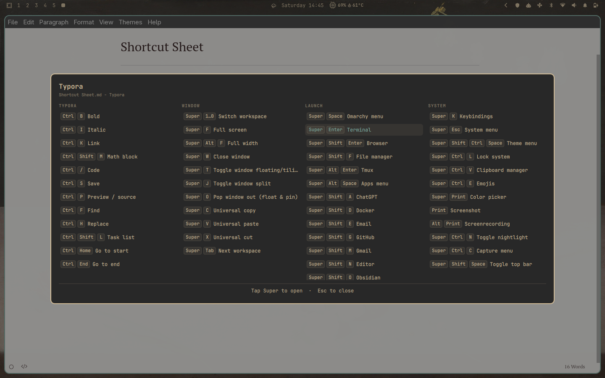

# Shortcut Sheet for Omarchy

Shortcut Sheet is a context-aware keyboard shortcut overlay for Omarchy Quattro.
Tap <kbd>Super</kbd> once to show the keyboard shortcuts available in the current
app or web page, alongside window, launcher, and system shortcuts.



The sheet refreshes and scans every live Hyprland binding each time it opens, so
desktop rows stay complete and aligned with your configuration. It also includes
curated shortcuts for terminals, browsers,
Files, Typora, VS Code-compatible editors, Gmail, GitHub, YouTube, X, ChatGPT,
Grok, Neovim, lazygit, QQ, and the Omarchy Agent.

## Features

- Context-aware application and web-page shortcuts
- Complete live scan of every Hyprland shortcut, including custom and media keys
- Type-to-filter navigation
- Keyboard and mouse selection
- Independent vertical group scrolling and horizontal category scrolling
- Theme-aware Omarchy UI
- No network access, background daemon, or elevated privileges

## Requirements

- Omarchy 4 (Quattro)
- Hyprland and Python 3, both included with Omarchy

There are no additional packages to install.

## Install

Install and enable the plugin from its public repository:

```sh
omarchy plugin add https://github.com/fze-fze/omarchy-shortcut-sheet.git --enable
```

Then add the following explicit bindings to `~/.config/hypr/bindings.lua`:

```lua
hl.unbind("SUPER + Super_L")
hl.unbind("SUPER + Super_R")
o.bind("SUPER + Super_L", "Shortcut sheet", "omarchy-shell -q shell summon io.github.fze-fze.shortcut-sheet", { release = true })
o.bind("SUPER + Super_R", "Shortcut sheet", "omarchy-shell -q shell summon io.github.fze-fze.shortcut-sheet", { release = true })
```

Hyprland reloads the bindings automatically. Tap either <kbd>Super</kbd> key to
open the sheet. Press <kbd>Esc</kbd> or click the dimmed background to close it.

`Super + K` remains Omarchy's full searchable keybinding list.

## Use

- Type to filter the visible shortcuts.
- Use <kbd>Up</kbd> and <kbd>Down</kbd> to move through results.
- Press <kbd>Enter</kbd> or click a row to run it.
- Press <kbd>Esc</kbd> once to clear a filter, then again to close the sheet.

## Update

```sh
omarchy plugin update io.github.fze-fze.shortcut-sheet
```

## Remove

First remove the four Shortcut Sheet lines from
`~/.config/hypr/bindings.lua`, then remove the plugin:

```sh
omarchy plugin remove io.github.fze-fze.shortcut-sheet
```

The plugin never edits user configuration, so removal does not leave behind any
plugin-created files or services.

## How it works

The overlay reads the focused window from `hyprctl activewindow -j` and parses
Omarchy's generated keybinding records. When you choose a runnable row, it asks
Hyprland to dispatch that shortcut after the overlay releases keyboard focus.

Plugins run unsandboxed inside `omarchy-shell`. Review the source before
installing any third-party plugin.

## Development

```sh
omarchy plugin validate .
node --test tests/model.test.mjs
python3 -m py_compile collect
bash -n run
```

## License

[MIT](LICENSE)
